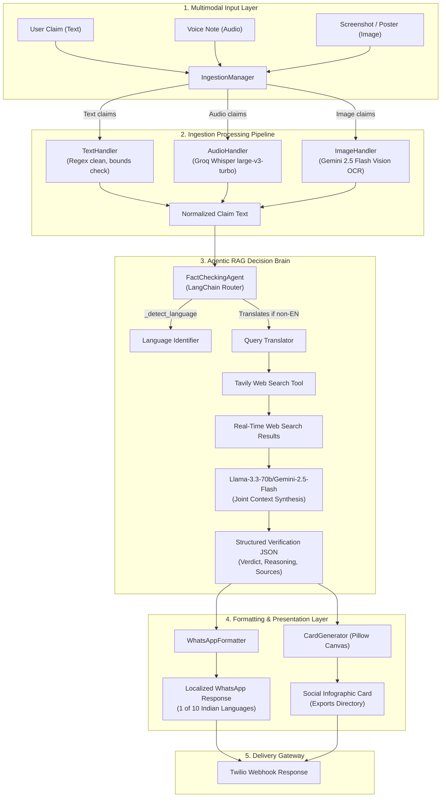

# 🛡️ Satyamev-Bot: Advanced Multimodal RAG-Driven Fact-Checking Engine

Satyamev-Bot is a production-grade, CPU-optimized, multilingual fact-checking and automated counter-misinformation platform. Operating as an agentic assistant, the bot digests claim payloads across **Text**, **Image (OCR)**, and **Audio (Speech-to-Text)** modalities, queries global web consensus through real-time search, processes facts via a LangChain decision engine, and produces professionally formatted WhatsApp replies and shareable visual infographic cards.

Designed for low-resource environments (such as free-tier CPU containers on Hugging Face Spaces), the engine routes intensive ML tasks to high-performance serverless endpoints (Google Gemini, Groq Whisper, and Groq Llama) while maintaining a lightweight local footprint.

---

## 🗺️ Architectural Topology & Flow



---

## 🌐 Comprehensive Multilingual Architecture

Satyamev-Bot provides production-ready, localized processing and response formatting for **10 Major Indian Languages** plus **English**. The pipeline automatically detects the claim language, performs search queries in English to pull the highest-authority global verification data, reasons internally, and outputs the result in the user's language.

### Supported Locales

| Language | ISO Code | Script / Font Fallback | Formatter Template Status |
| :--- | :---: | :--- | :---: |
| **English** | `en` | Standard Sans-Serif | ✅ Fully Supported |
| **Hindi** | `hi` | Devanagari (Nirmala / FreeSans) | ✅ Fully Supported |
| **Bengali** | `bn` | Bengali (Nirmala / FreeSans) | ✅ Fully Supported |
| **Marathi** | `mr` | Devanagari (Nirmala / FreeSans) | ✅ Fully Supported |
| **Telugu** | `te` | Telugu (Nirmala / FreeSans) | ✅ Fully Supported |
| **Tamil** | `ta` | Tamil (Nirmala / FreeSans) | ✅ Fully Supported |
| **Gujarati** | `gu` | Gujarati (Nirmala / FreeSans) | ✅ Fully Supported |
| **Urdu** | `ur` | Nastaliq/Arabic (Nirmala / FreeSans) | ✅ Fully Supported |
| **Kannada** | `kn` | Kannada (Nirmala / FreeSans) | ✅ Fully Supported |
| **Odia** | `or` | Odia (Nirmala / FreeSans) | ✅ Fully Supported |
| **Malayalam** | `ml` | Malayalam (Nirmala / FreeSans) | ✅ Fully Supported |

### The Multilingual Pipeline Workflow

1. **Language Identification**: The decision engine triggers a prompt against `gemini-2.5-flash` or `llama-3.3-70b` to detect the language of the ingested claim.
2. **Cross-Lingual Search (Query Translation)**: Regional languages are translated into English search queries. This ensures the Tavily search engine pulls from the highest-index global databases and local Indian fact-checking platforms (like AltNews, BoomLive, PIB FactCheck).
3. **Consensus Aggregation**: The agent reasons over retrieved English resources, synthesizing the truth value (Verdict: `TRUE`, `FALSE`, `MISLEADING`, or `UNVERIFIABLE`).
4. **Target Script Rendering**: The agent translates the explanation and key evidence back into the detected regional script.
5. **WhatsApp Interface Localization**: The `WhatsAppFormatter` pulls the corresponding language dictionary to display localized section headers (e.g., *Analysis* becomes *विश्लेषण* in Hindi, *વિશ્લેષણ* in Gujarati, and *تجزیہ* in Urdu).

---

## 📁 Repository Structure and Directory Layout

The directory layout is strictly modularized into functional phases:

```
SATYAMEV-BOT/
├── .github/
│   └── workflows/
│       └── deploy.yml            # CI/CD deployment to Hugging Face Spaces
├── exports/                      # Target directory for generated visual cards
├── logs/                         # Application output and audit logs
├── src/                          # Application source code root
│   ├── __init__.py
│   ├── config.py                 # Pydantic Settings and validation configuration
│   ├── api/                      # Gateway API layer
│   │   ├── __init__.py
│   │   └── app.py                # FastAPI gateway, Webhooks, Twilio integrations
│   ├── brain/                    # Decision engine (Brain)
│   │   ├── __init__.py
│   │   ├── agent.py              # FactCheckingAgent class & prompt layouts
│   │   ├── config.py             # Brain provider options & strategy config
│   │   └── tools.py              # Tavily WebSearch & VectorDB tools
│   ├── cards/                    # Visual card generator
│   │   ├── __init__.py
│   │   ├── config.py             # Theme variables (colors, canvas sizes)
│   │   └── generator.py          # Pillow rendering and text wrapping
│   ├── ingestion/                # Multimodal Ingestion Layer
│   │   ├── __init__.py
│   │   ├── audio_handler.py      # Whisper client for transcribing audio notes
│   │   ├── image_handler.py      # Gemini Vision OCR & fallback OCR managers
│   │   ├── text_handler.py       # Basic text normalizer & bounds validation
│   │   └── ingestion_manager.py  # Orchestrates routing between handlers
│   └── whatsapp/                 # WhatsApp Formatter
│       ├── __init__.py
│       └── formatter.py          # Multilingual string output builder
├── tests/                        # Test automation suites
│   ├── __init__.py
│   ├── test_api.py               # API endpoint integrations
│   ├── test_brain.py             # Agent reasoning & search testing
│   ├── test_cards.py             # Image card generation testing
│   ├── test_ingestion.py         # Modality input routing tests
│   ├── test_phase0.py            # Basic configuration and loader tests
│   └── test_whatsapp.py          # Message parsing and template tests
├── .env.example                  # Environment configuration template
├── .gitignore                    # Version control ignore lists
├── Dockerfile                    # Containerization instructions for HF Spaces
├── requirements.txt              # Standard Python project requirements
└── README.md                     # This file
```

---

## 🔧 Subsystem Deep-Dive

### 1. Multimodal Ingestion Pipeline (`src/ingestion/`)

The Ingestion layer acts as the entry gateway. It intercepts incoming raw data payloads, normalizes metadata, filters out invalid requests, and transcribes or extracts text.

*   **`text_handler.py`**: Ensures claims fit within the length bounds (minimum 10 characters, maximum 5000 characters). Performs string stripping, normalizes extra spaces, and screens out plain punctuation strings.
*   **`audio_handler.py`**: Accepts voice clips in formats like `.ogg`, `.mp3`, `.wav`, and `.m4a`. Calls Groq's high-speed Whisper endpoint (`whisper-large-v3-turbo`) with language auto-detection enabled to transcribe the voice note into its native script.
*   **`image_handler.py`**: Uses `gemini-2.5-flash` to execute image OCR. If the primary engine is unavailable or the output contains less than 10 characters, it triggers a fallback sequence.
*   **`ingestion_manager.py`**: Standardizes the output structure to:
    ```json
    {
      "success": true,
      "text": "Extracted claim string",
      "modality": "image",
      "error": null
    }
    ```

---

### 2. Decision Engine Brain (`src/brain/`)

The decision engine orchestrates search tools, parses claims, and compiles the final verification consensus.

*   **`agent.py`**: Integrates LangChain ChatModels (`Groq` or `GoogleGenAI`). Executes the prompt architecture:
    1.  **Language Identification**: Determines the user's language.
    2.  **Claim Extraction**: Distills the core assertion, ignoring filler words.
    3.  **Search Synthesis**: Translates the claim into English, retrieves up to 5 Tavily web search results, and aggregates the context.
    4.  **Consensus Reasoning**: Cross-references claims against reliable search snippets, resolves conflicting reports, and grades the confidence score (0.0 to 1.0).
    5.  **Output Mapping**: Emits a strictly structured JSON payload matching this Pydantic schema:
        ```python
        class FactCheckResult(BaseModel):
            success: bool
            verdict: str  # TRUE | FALSE | MISLEADING | UNVERIFIABLE
            confidence: float  # 0.0 to 1.0
            reasoning: str  # Native-language analysis paragraph
            key_evidence: List[str]  # Native-language bullet points
            sources: List[str]  # Verified URL links
            language: str  # Detected language name (e.g. "Hindi")
        ```

---

### 3. Visual Card Generator (`src/cards/`)

To combat visual disinformation on social media, Satyamev-Bot compiles real-time fact-checks into shareable visual cards.

*   **Canvas & Layout**: Renders 1080x1080 high-resolution square images using Pillow. Supports dynamic background themes (Dark Mode, Light Mode, Glassmorphic gradients).
*   **Font Engine**: Scans system fonts and prioritizes `Nirmala.ttf` (or standard Linux `FreeSans.ttf` fallbacks) to ensure Indic script rendering (Devanagari, Bengali, Telugu, Tamil, Kannada, etc.) does not result in broken square symbols.
*   **Word-Wrap Logic**: Automatically wraps text dynamically based on string lengths and font sizes.
*   **Visual Elements**: Adds a color-coded verdict banner, a progress bar matching the confidence level, key evidence lists, and verified source domains.

---

### 4. WhatsApp Response Formatter (`src/whatsapp/`)

Formatted outputs are customized using localization templates.

*   **Localization Dictionary**: `LANG_TEMPLATES` maps structural strings to their respective translations for all 10 target regional languages.
*   **Verdict Localization**: `VERDICT_TRANSLATIONS` maps standard verdict tags (e.g., `TRUE`, `FALSE`) to localized titles (e.g., `સાચું (TRUE)`, `सत्य (TRUE)`).
*   **Validation Fallbacks**: If a language is not explicitly listed, the formatter defaults gracefully to English templates to prevent message delivery crashes.

---

### 5. API Gateway (`src/api/`)

A production FastAPI instance serves the webhook gateway.

*   **Webhook Interface (`/whatsapp`)**: Consumes incoming `application/x-www-form-urlencoded` payloads from Twilio's webhook.
*   **Asynchronous Job Handlers**: Offloads heavy tasks to background workers, immediately returning a status code to Twilio.
*   **Bilingual Acknowledgment**: Responds instantly to the user with a localized status update while processing continues.
*   **Twilio REST Delivery**: Uses the Twilio Client to push the final text response and the visual card URL once verification is complete.

---

## 🛠️ Local Development & Quick Start

Follow these instructions to set up, configure, and execute the Satyamev-Bot locally on a Windows or Linux system.

### Prerequisites

*   Python 3.10 or 3.11 installed.
*   External API accounts and API keys:
    *   **Groq API Key**: For Whisper STT and Llama reasoning models.
    *   **Google Gemini API Key**: For Vision OCR and fallback LLM reasoning.
    *   **Tavily API Key**: For web search indexing.

### 1. Environment Setup

Clone the repository and navigate to the project directory:

```bash
cd SATYAMEV-BOT
python -m venv venv
```

Activate the virtual environment:

*   **Windows (PowerShell)**:
    ```powershell
    .\venv\Scripts\Activate.ps1
    ```
*   **Linux/macOS**:
    ```bash
    source venv/bin/activate
    ```

Install dependencies:

```bash
pip install --upgrade pip setuptools wheel
pip install -r requirements.txt
```

### 2. Configure Settings

Copy the environment template:

```bash
cp .env.example .env
```

Edit the `.env` file and insert your API credentials:

```ini
# Core API Keys
GROQ_API_KEY=gsk_your_groq_api_key_here
GOOGLE_API_KEY=AIzaSy_your_gemini_api_key_here
TAVILY_API_KEY=tvly-your_tavily_api_key_here

# App Engine Configuration
IMAGE_ENGINE=gemini
APP_ENV=development
DEBUG=true
```

Verify your environment configuration:

```bash
python src/config.py
```

---

## 🧪 Comprehensive Testing Suite

Satyamev-Bot contains unit and integration tests. Run tests from the project root using your virtual environment's python.

### Running Ingestion Pipeline Tests
Tests text cleaning, audio transcription, and image OCR fallback operations:

```bash
python -m unittest tests/test_ingestion.py
```

### Running Decision Brain Tests
Tests claim extraction, translation routing, Tavily search aggregation, and confidence grading:

```bash
python -m unittest tests/test_brain.py
```

### Running Card Generation Tests
Tests rendering, font sizing, and visual exports to the `exports/` directory:

```bash
python -m unittest tests/test_cards.py
```

### Running WhatsApp Formatter Tests
Tests parser rules, formatting layout, and localization dictionaries:

```bash
python -m unittest tests/test_whatsapp.py
```

### Running API Gateway Tests
Tests endpoint controllers, Twilio webhooks, and status messages:

```bash
python -m unittest tests/test_api.py
```

---

## 🐳 Containerization and Production Deployment

Satyamev-Bot is optimized for production execution within a Docker container.

### The Dockerfile Blueprint

The production `Dockerfile` uses a Python slim image and includes packages for font support and rendering, such as `libgl1` and `fonts-freefont-ttf`.

```dockerfile
FROM python:3.11-slim

WORKDIR /app

RUN apt-get update && apt-get install -y --no-install-recommends \
    build-essential \
    libgl1 \
    libglib2.0-0 \
    fonts-freefont-ttf \
    && rm -rf /var/lib/apt/lists/*

COPY requirements.txt .
RUN pip install --no-cache-dir -r requirements.txt

COPY . .

EXPOSE 7860

CMD ["uvicorn", "src.api.app:app", "--host", "0.0.0.0", "--port", "7860"]
```

### Deploying to Hugging Face Spaces

1. Create a **Hugging Face Space** with the **Docker SDK**.
2. Configure your Hugging Face Secrets with the following keys:
   * `GROQ_API_KEY`
   * `GOOGLE_API_KEY`
   * `TAVILY_API_KEY`
3. Push your repository to the Hugging Face Space git remote. The space will build the Docker container and start the uvicorn gateway on port `7860`.

---

## 📜 Development Guidelines and Standards

To maintain code quality across contributions, adhere to the following guidelines:

1.  **Exhaustive Exception Handling**: Never use bare `except: pass` blocks. Catch specific exceptions and log the stack trace using python's built-in `logging` module.
2.  **Resource Lifecycle Control**: Ensure file handlers (such as audio files or Pillow canvases) are properly closed or wrapped inside `with` blocks.
3.  **Strict Pydantic Validation**: All configuration variables must go through `src/config.py` and subclass Pydantic's `BaseSettings`.
4.  **CPU Optimization**: Route heavy workloads (such as image understanding and transcription) to serverless APIs. Keep local compute footprints lightweight.
5.  **Multi-Language Testing**: Run validation scripts (such as `test_multilingual_formatter.py`) before pushing code changes to verify translation integrity.
